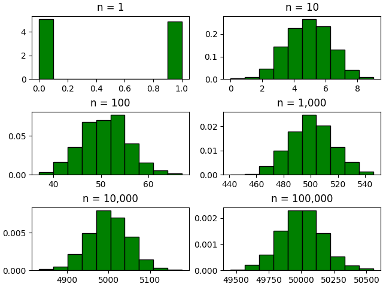

# Binomial Distirbution Convergence to Normal in the Large *N* Limit

## Theory

The proof presented here demonstrates that for a binomial probability distribution function, *B(n,p)*, where n is the number of trials and p is the probability of success, that as n increases towards infinity, the distribution converges towards a normal probability distribution. The goal of this presentation is to test this theory using random number generators and data visualization.

## Method

For this presentation, Python and packages (numpy, matplotlib) will be utilized. The numpy package has built-in random number generators to model probability distributions, including binomial and normal distributions. To test the theory, the *n* parameter will be gradually increased, while maintaining a consistent *p* parameter, to demonstrate the convergence to normal.

## Test

As mentioned in the method section, the primary test will be visualizing binomial distributions of increasing *n*.

See below for the binomial distributions created in Python:

`rng = np.random.default_rng()` \
`binomial1 = rng.binomial(1,0.5,1000)` \
`binomial2 = rng.binomial(10,0.5,1000)` \
`binomial3 = rng.binomial(100,0.5,1000)` \
`binomial4 = rng.binomial(1000,0.5,1000)` \
`binomial5 = rng.binomial(10000,0.5,1000)` \
`binomial6 = rng.binomial(100000,0.5,1000)`

The `rng` variable creates the random number generator, and the six following binomial variables, following `rng.binomial(n,p,size)` are created, with consistent *p* and *size* and varying *n*.

See below for each of the distributions plotted into histograms:

As can be seen in the figure above, as we increase n, the distributions begin to converge into a normal distribution pattern, where *n = 1* being an extreme with no normal pattern, and *n = 100,000* having a very normal distribution pattern.

